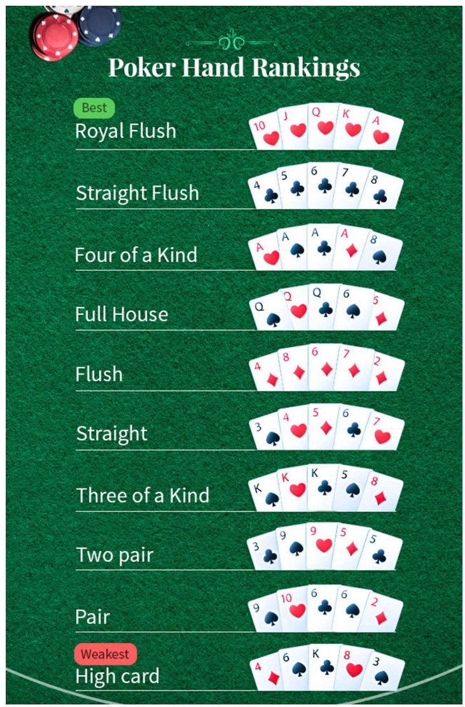

# My Poker Hands
### This repo solves below Poker Hands puzzle with best practices and design principles

### Code Reference
[Data Model](./src/main/java/com/poker/model)  
[Services](./src/main/java/com/poker/service) 
[Facade](./src/main/java/com/poker/facade) 
[Test Cases](./src/test/java/com/poker/facade) 